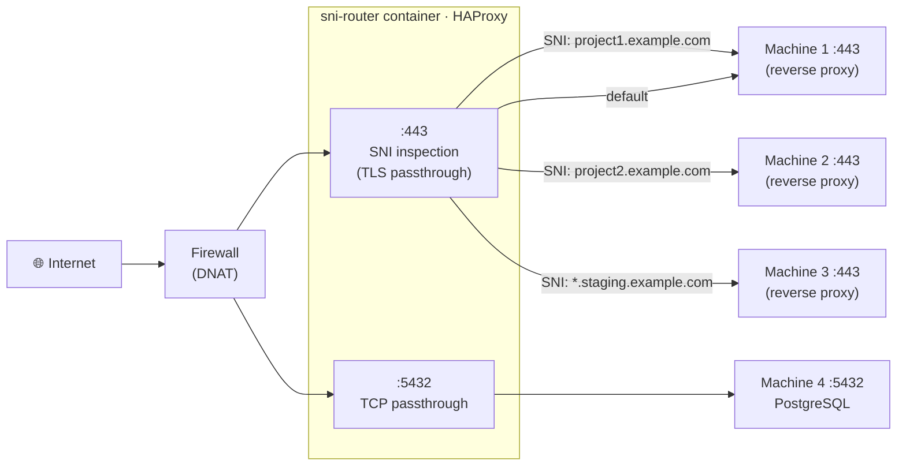

# sni-router

[](https://github.com/BitsDiver/sni-router/actions/workflows/docker-publish.yml)
[](https://github.com/BitsDiver/sni-router/pkgs/container/sni-router)
[](LICENSE)

TLS/SNI passthrough router running on **HAProxy**. Routes incoming HTTPS (and any TLS) traffic to different backends based on the SNI hostname in the TLS ClientHello — **without decrypting anything**. Also supports plain TCP routing by port.

Configured entirely via **environment variables**. No config file to maintain.

---

## Architecture



> The TLS stream is forwarded **byte-for-byte** — sni-router never decrypts anything. Each backend manages its own certificates.

If `PROXY_PROTOCOL=true`, HAProxy prepends a **PROXY protocol v2** header to each forwarded connection so backends can recover the **real client IP**.

---

## Quick start

```bash
# Pull the image
docker pull ghcr.io/bitsdiver/sni-router:latest

# Or build locally
git clone https://github.com/BitsDiver/sni-router.git
cd sni-router
docker build -t sni-router .
```

Create a `.env` from the template and adjust values:

```bash
cp .env.example .env
$EDITOR .env
docker compose up -d
```

---

## Environment variables

### TLS / SNI routing

| Variable          | Required     | Default | Description                                         |
| ----------------- | ------------ | ------- | --------------------------------------------------- |
| `SNI_LISTEN_PORT` | No           | `443`   | Port HAProxy listens on for TLS traffic             |
| `SNI_ROUTE_N`     | At least one | —       | Routing rule: `hostname:backend_ip:backend_port`    |
| `SNI_DEFAULT`     | **Yes**      | —       | Default backend when no SNI rule matches: `ip:port` |

`N` must be consecutive integers starting at `1` (`SNI_ROUTE_1`, `SNI_ROUTE_2`, …).

**Wildcard hostnames** are supported: `*.example.com` will match any subdomain of `example.com`.

### Plain TCP routing (no TLS)

| Variable      | Required | Default | Description                                            |
| ------------- | -------- | ------- | ------------------------------------------------------ |
| `TCP_ROUTE_N` | No       | —       | Port-based rule: `listen_port:backend_ip:backend_port` |

Each `TCP_ROUTE_N` creates a dedicated HAProxy frontend on `listen_port`. No SNI inspection — traffic is forwarded as-is.

> Remember to expose each `listen_port` in your `docker-compose.yml` `ports:` section.

### PROXY protocol

| Variable         | Required | Default | Description                                                    |
| ---------------- | -------- | ------- | -------------------------------------------------------------- |
| `PROXY_PROTOCOL` | No       | `false` | Send PROXY protocol v2 header to all backends (`true`/`false`) |

When enabled, HAProxy prepends a PROXY protocol v2 header carrying the real client IP to every forwarded connection. Your backend must be configured to accept it.

### Health checks

By default every backend is **TCP-checked** every 2 seconds (`check inter 2s fall 3 rise 2`). This detects whether the port is open and automatically removes/restores backends during redeployments.

For deeper **application-level** verification you can point HAProxy at an HTTPS health-check endpoint per backend. HAProxy will open its own TLS connection (without certificate verification) and send an HTTP `GET` request.

| Variable             | Required | Default | Description                                                |
| -------------------- | -------- | ------- | ---------------------------------------------------------- |
| `SNI_HEALTH_N`       | No       | _(TCP)_ | HTTPS health-check path for `SNI_ROUTE_N` (e.g. `/health`) |
| `SNI_DEFAULT_HEALTH` | No       | _(TCP)_ | HTTPS health-check path for the `SNI_DEFAULT` backend      |
| `TCP_HEALTH_N`       | No       | _(TCP)_ | HTTPS health-check path for `TCP_ROUTE_N` (e.g. `/health`) |

When a `*_HEALTH_*` variable is **not set**, the corresponding backend keeps a plain TCP connect check.

**Example** — enable an HTTPS health check for the first SNI route:

```yaml
environment:
  SNI_ROUTE_1: "app.example.com:192.168.1.10:443"
  SNI_HEALTH_1: "/api/health" # GET https://app.example.com/api/health
  SNI_ROUTE_2: "api.example.com:192.168.1.20:443"
  # SNI_HEALTH_2 not set → plain TCP check
  SNI_DEFAULT: "192.168.1.10:443"
  SNI_DEFAULT_HEALTH: "/health"
```

**Example — Traefik:**

```yaml
# traefik static config
entryPoints:
  websecure:
    proxyProtocol:
      trustedIPs:
        - "192.168.1.5" # IP of the sni-router container
```

**Example — nginx:**

```nginx
server {
    listen 443 ssl proxy_protocol;
    set_real_ip_from 192.168.1.5;
    real_ip_header proxy_protocol;
}
```

### HAProxy stats UI

| Variable         | Required | Default  | Description                                            |
| ---------------- | -------- | -------- | ------------------------------------------------------ |
| `STATS_ENABLED`  | No       | `false`  | Enable the built-in HAProxy web dashboard              |
| `STATS_PORT`     | No       | `8404`   | Port for the stats UI                                  |
| `STATS_PASSWORD` | No       | _(none)_ | Password for user `admin`. Leave empty to disable auth |

Access the dashboard at `http://<local-ip>:<STATS_PORT>/stats`.

> ⚠️ **Always bind the stats port to a local network interface**, never to `0.0.0.0` on a public-facing host.
> In `docker-compose.yml`: `"192.168.1.5:8404:8404"` instead of `"8404:8404"`.

---

## docker-compose example

```yaml
services:
  sni-router:
    image: ghcr.io/bitsdiver/sni-router:latest
    restart: unless-stopped
    ports:
      - "443:443"
      # Bind stats UI to local network interface only
      - "192.168.1.5:8404:8404"
    environment:
      SNI_LISTEN_PORT: "443"

      SNI_ROUTE_1: "project1.example.com:192.168.1.10:443"
      SNI_ROUTE_2: "project2.example.com:192.168.1.20:443"
      SNI_ROUTE_3: "*.staging.example.com:192.168.1.30:443"
      SNI_DEFAULT: "192.168.1.10:443"

      PROXY_PROTOCOL: "true"

      STATS_ENABLED: "true"
      STATS_PORT: "8404"
      STATS_PASSWORD: "changeme"
```

---

## Testing

**Validate SNI routing** (the certificate returned must be the one from the backend, not from sni-router):

```bash
openssl s_client -connect <public-ip>:443 -servername project1.example.com </dev/null 2>&1 | grep "subject="
openssl s_client -connect <public-ip>:443 -servername project2.example.com </dev/null 2>&1 | grep "subject="
```

**Test default fallback** (unknown SNI → SNI_DEFAULT):

```bash
openssl s_client -connect <public-ip>:443 -servername unknown.example.com </dev/null 2>&1 | grep "subject="
```

**Test plain TCP route** (e.g. PostgreSQL on port 5432):

```bash
psql -h <public-ip> -p 5432 -U myuser mydb
```

---

## Multi-arch support

The published image supports the following platforms:

| Platform       | Architecture                             |
| -------------- | ---------------------------------------- |
| `linux/amd64`  | x86-64 servers, VMs                      |
| `linux/arm64`  | ARM64 (Apple M\*, AWS Graviton, RPi 4/5) |
| `linux/arm/v7` | ARMv7 (Raspberry Pi 2/3)                 |

Docker will automatically pull the correct variant for your host.

---

## How it works

1. The container starts and `entrypoint.sh` runs before HAProxy.
2. The script reads `SNI_ROUTE_N` and `TCP_ROUTE_N` variables, generates a valid `haproxy.cfg`, and runs `haproxy -c -f` to validate it.
3. If validation passes, HAProxy starts. If not, the container exits immediately with an error.
4. For TLS connections, HAProxy reads **only the TLS ClientHello** (the SNI field) without decrypting anything, then forwards the raw TCP byte stream to the matching backend.
5. For plain TCP routes, HAProxy forwards by listen port without any inspection.

---

## License

MIT — see [LICENSE](LICENSE).
