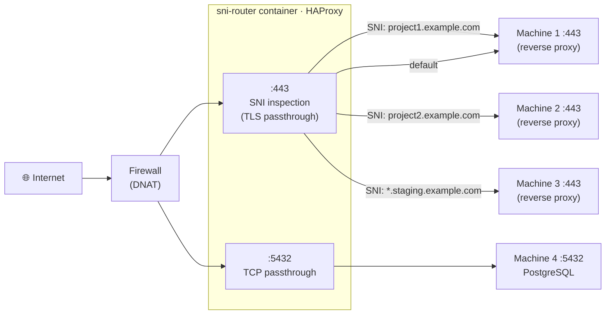

# Introduction

**SNI Router** is a zero-configuration TLS/SNI passthrough router built on [HAProxy](https://www.haproxy.org/). It sits in front of your infrastructure and routes incoming HTTPS connections to different backends based on the **SNI hostname** embedded in the TLS ClientHello — without decrypting the TLS stream.

## What it does

- Reads the SNI hostname from the TLS ClientHello and forwards the raw TCP stream to the matching backend
- Supports wildcard rules (`*.example.com`) with automatic precedence over exact rules
- Routes plain TCP connections by listen port (no TLS inspection)
- Optionally serves an HTTP frontend for Let's Encrypt http-01 ACME challenge forwarding
- Prepends a PROXY protocol v2 header so backends can recover the real client IP
- Exposes the built-in HAProxy stats dashboard for live connection monitoring
- Generates and validates `haproxy.cfg` from environment variables at every container start

## What it does NOT do

- It does not terminate TLS — the TLS stream is forwarded byte-for-byte; each backend manages its own certificate
- It does not modify HTTP headers or inspect request bodies
- It does not have a web management API — all configuration is done via environment variables

## Architecture



> The TLS stream is forwarded **byte-for-byte**. SNI Router never decrypts anything. Each backend manages its own certificates.

## Where it fits

SNI Router is typically placed behind a firewall (using DNAT) and in front of one or more reverse proxies (such as Traefik). It solves the problem of routing traffic to the correct reverse proxy instance when multiple machines share a single public IP.

```
Internet → Firewall (DNAT :443) → sni-router :443 → Traefik A (machine 1)
                                                   → Traefik B (machine 2)
                                                   → Traefik C (machine 3) [wildcard]
```

## Technology stack

| Component  | Version      | Role                                                           |
| ---------- | ------------ | -------------------------------------------------------------- |
| HAProxy    | 3.3 (Alpine) | TCP/TLS proxy engine                                           |
| Shell      | POSIX sh     | `entrypoint.sh` — generates `haproxy.cfg` from env vars        |
| Docker     | any          | Packaging and deployment                                       |

## Multi-arch support

The published image supports `linux/amd64`, `linux/arm64`, and `linux/arm/v7`. Docker automatically pulls the correct variant for your host.
